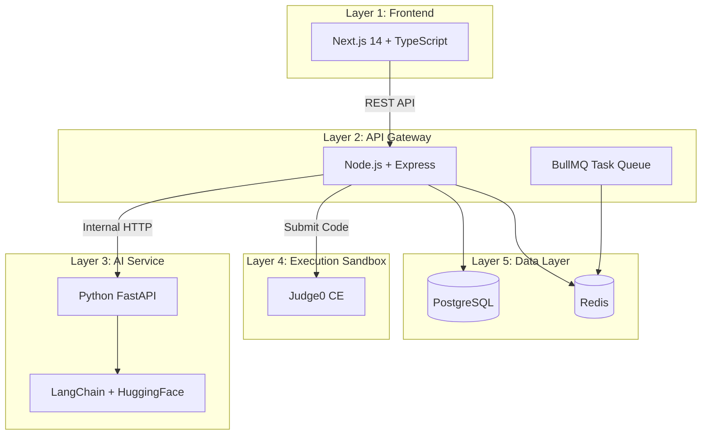

# 🏆 AI-Powered Adaptive Competitive Programming Platform

> An intelligent competitive programming training platform that generates personalized problems, evaluates code with AI, and tracks progress using spaced repetition — built as an M.Sc. Computer Science final-year project.

## Architecture



## Tech Stack

| Layer | Technology | Purpose |
|-------|-----------|---------|
| Frontend | Next.js 14, TypeScript, Tailwind CSS, Monaco Editor, Recharts, Zustand, React Query | UI, IDE, charts, state |
| API Gateway | Node.js, Express, JWT, Zod, BullMQ | Auth, validation, task queue |
| AI Service | Python 3.11, FastAPI, LangChain, Hugging Face | Problem generation, code evaluation |
| Sandbox | Judge0 CE (Docker) | Isolated code execution |
| Data | PostgreSQL (Prisma), Redis (ioredis) | Persistence, cache, leaderboard |
| Infra | Docker Compose | Local orchestration |

## Quick Start

### Prerequisites
- [Docker Desktop](https://www.docker.com/products/docker-desktop/) (v24+)
- [Node.js](https://nodejs.org/) (v20 LTS)
- [Python](https://www.python.org/) (v3.11+)
- [Git](https://git-scm.com/)

### Setup

```bash
# 1. Clone the repository
git clone <repo-url>
cd ai-competitive-platform

# 2. Create environment file
cp .env.example .env
# Edit .env with your actual secrets

# 3. Start infrastructure (Postgres, Redis, Judge0)
docker compose up -d

# 4. Install backend dependencies & run migrations
cd backend
npm install
npx prisma migrate dev
npm run dev

# 5. Install frontend dependencies
cd ../frontend
npm install
npm run dev

# 6. Start AI service
cd ../ai-service
pip install -r requirements.txt
uvicorn main:app --reload --port 8000
```

## Project Structure

```
/
├── frontend/          → Next.js 14 app (Layer 1)
├── backend/           → Express API gateway (Layer 2)
├── ai-service/        → FastAPI + LangChain (Layer 3)
│   └── prompts/       → LangChain prompt templates
├── judge0/            → Judge0 Docker config (Layer 4)
├── docker-compose.yml → Infrastructure orchestration (Layer 6)
├── schema.prisma      → Database schema (Layer 5)
├── .env.example       → Environment template
└── README.md
```

## Development Roadmap

- [x] **Phase 0** — Project initialization & infrastructure
- [ ] **Phase 1** — Authentication system (JWT)
- [ ] **Phase 2** — AI problem generator
- [ ] **Phase 3** — IDE interface (Monaco Editor)
- [ ] **Phase 4** — Code execution (Judge0)
- [ ] **Phase 5** — AI code evaluator
- [ ] **Phase 6** — Spaced repetition
- [ ] **Phase 7** — Ranking system
- [ ] **Phase 8** — Stats dashboard

## License

This project is developed as part of an M.Sc. Computer Science thesis.
